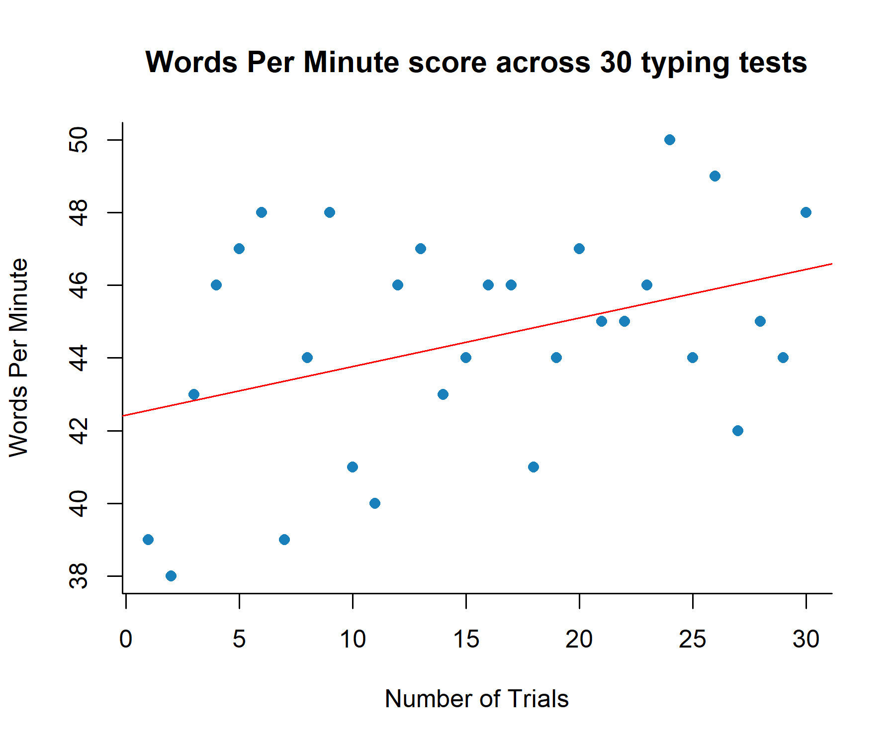

# Data Science Projects
**Author:** Darragh Coyle  
**Contact:** [LinkedIn](https://www.linkedin.com/in/darragh-coyle/) 

---

## Man vs. Keyboard: Statistical Analysis of My Typing Ability - [Full Report (.pdf)](./stats_report.pdf)

**Goal:** Take data from day-to-day life and use statistical techniques to get deeper insights into how I approach the task of self-improvement 

Using <https://www.typingtest.com>, collected 30 observations over 4 weeks.

* **Variables:**
    * **Performance:** WPM (Words Per Minute), Accuracy (%).
    * **Test Conditions:** Test length (1 vs. 3 minutes), Test difficulty (Easy vs. Hard). 
    * **Environment:** Caffeine (Y/N), Music (Y/N), Time of Day, Location (Home, Library, Cafe).

---

## Statistics Overview

| Question | Statistical Test | 
| :--- | :--- | 
| **Does practice make perfect?** | `Linear Regression` | 
| **Does music help me focus?** | `Bayesian Inference` | 
| **Do I work better in public or private?** | `Chi-sqaured Test` | 
| **How is my work-life balance?** |`Fisher's Exact Test`|

  
  

